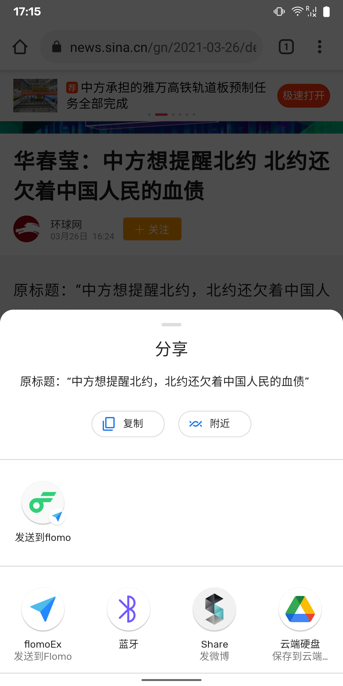

# flomoEx

## 简介
一个为 [flomo](https://flomoapp.com/) Android平台开发的小工具。
实现的功能很简单，当你在任意app中选中一段文字时使用系统级分享功能（Share sheet），可以一键发送到flomo。
如下图所示：

如果你的手机系统恰巧支持原生Android的Direct Share功能，那么你将能在系统Share sheet的顶部直接看到分享入口，
不用在下面一堆app列表中苦苦寻找了～

## Build
Build apk的话，记得修改 app/build.gradle 里的 *signingConfigs*，改为你自己的签名文件。

## 下载
见 [Release](https://github.com/wuzeyou/flomoEx/releases) 页。